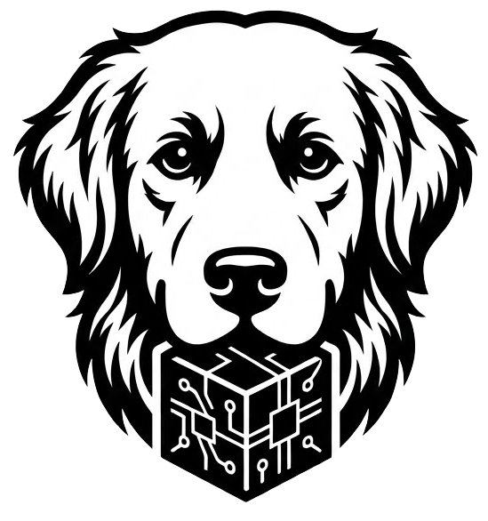

# 🐕 Implementierung einer Data Analytics Pipeline (DRC Case Study)



Dieses Projekt ist eine Implementierung einer **Data Analytics Pipeline** zur Analyse von Gesundheits- und Zuchtdaten der Retriever-Population. Es entstand im Rahmen des Mastermoduls **"Data Analytics & Machine Learning in der Anwendung"**.

Ziel des Projektes ist die automatisierte Akquisition (Ingestion), Bereinigung (Cleaning) und Integration von Daten aus der öffentlichen Datenbank des Deutschen Retriever Clubs (DRC).

---

## 📋 Pipeline-Phasen & Features

Das System bildet die ersten kritischen Phasen einer Data Analytics Pipeline ab:

### 1. Kollektion / Akquisition (Data Ingestion)
* **Dynamische Datenquelle:** Anbindung der Web-Schnittstelle des DRC (statt statischer Dateiexporte).
* **Batch Ingestion:** Automatisierter Abruf von Bestandsdaten mittels **cURL** und iterativer API-Calls für spezifische Merkmale.

### 2. Bereinigung (Data Cleaning)
* **Automatisierte Validierung:** Rule-Based Parsing während des Imports.
* **Normalisierung:** Vereinheitlichung inkonsistenter Datumsformate (US/ISO) und Handling von `NULL`-Werten.

### 3. Transformation & Integration
* **Semantisches Mapping:** Übersetzung technischer API-Keys (z.B. `CondGT_01`) in fachliche Attribute (`prcd-PRA: frei`).
* **Data Enrichment:** Zusammenführung von Stammdaten und Gesundheitsbefunden in eine zentrale **"Single Source of Truth"** (MySQL).

### 4. Visualisierung (UI)
* Einsatz von **Filament PHP** als Admin-Dashboard zur explorativen Datenanalyse und Überprüfung der Datenqualität.

---

## 🛠 Tech Stack

* **Environment:** [DDEV](https://ddev.com/) (Docker-basiert)
* **Backend:** [Laravel](https://laravel.com/) (PHP Framework)
* **Frontend / Admin:** [Filament PHP](https://filamentphp.com/)
* **Datenbank:** MySQL / MariaDB
* **Tools:** cURL, Artisan Console

---

## 🚀 Installation (Lokal)

Folge diesen Schritten, um die Pipeline lokal in einer isolierten Docker-Umgebung zu starten.

### Voraussetzungen
* [Docker Desktop](https://www.docker.com/) installiert & gestartet.
* [DDEV](https://ddev.com/) installiert.

### Schritt-für-Schritt Setup

1.  **Repository klonen**
    ```bash
    git clone [https://github.com/DEIN-USER/drc-fetch.git](https://github.com/DEIN-USER/drc-fetch.git)
    cd drc-fetch
    ```

2.  **DDEV Umgebung starten**
    ```bash
    ddev start
    ```

3.  **Abhängigkeiten installieren**
    ```bash
    ddev composer install
    ```

4.  **Konfiguration**
    Erstelle die Environment-Datei und generiere den App-Key:
    ```bash
    cp .env.example .env
    ddev artisan key:generate
    ```

5.  **Datenbank & User einrichten**
    Führe die Migrationen durch und erstelle einen Admin-User für das Dashboard:
    ```bash
    ddev artisan migrate
    ddev artisan make:filament-user
    # Folge den Anweisungen im Terminal
    ```

---

## 🖥️ Nutzung: Die Pipeline starten

### Schritt 1: Data Ingestion (Import)
Starte den ETL-Prozess (Extract, Transform, Load) über die Konsole. Dieser Befehl ruft die API ab, bereinigt die Daten und speichert sie lokal.

```bash
ddev artisan drc:import
